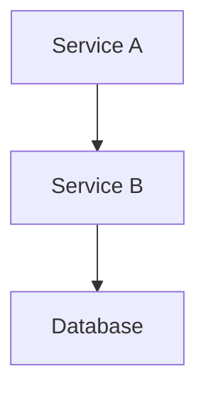
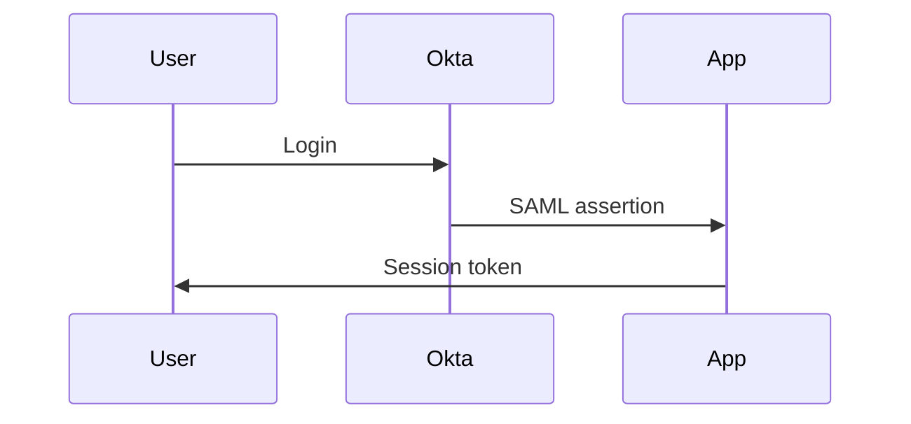

# GitHub CLI (gh) Expert Skill

This skill provides comprehensive guidance for using the GitHub CLI (`gh`) for repository management, pull requests, issues, notifications, and automation workflows.

## ⚠️ Critical: GraphQL Permission Errors

**Common Issue**: Commands like `gh pr view`, `gh pr edit`, and `gh pr create` may fail with cryptic GraphQL errors in organization repositories:

```
GraphQL: Resource not accessible by personal access token (repository.pullRequest.reviewRequests)
```

**Quick Fix**: Use `gh api` with REST endpoints instead of high-level commands.

**Example**:
```bash
# Instead of: gh pr edit 1560 --body "New description"
# Use this instead:
gh api --method PATCH /repos/owner/repo/pulls/1560 -f body="New description"
```

**Why This Happens**: The GraphQL API used by `gh pr` commands tries to access organization-level fields that classic personal access tokens cannot read, even with all scopes enabled. The REST API uses different permission checks and succeeds where GraphQL fails.

### GitHub Issue Types

GitHub repos can have first-class Issue Types (Initiative, Epic, Task, Bug, Enhancement, etc.) visible in the issue UI as a "Type" dropdown. These are **not** labels — they are a structured metadata field.

**Always use Issue Types when available.** Do not encode the type in the title (e.g., "Epic: Foo" or "Initiative: Bar"). Set the type via the GraphQL API instead.

**Discover available types for a repo:**
```bash
gh api graphql -f query='{
  repository(owner: "ORG", name: "REPO") {
    issueTypes(first: 20) {
      nodes { id name description }
    }
  }
}'
```

**Set the issue type on an existing issue:**
```bash
# Dedicated mutation (preferred — clearer intent)
gh api graphql -f query='mutation {
  updateIssueIssueType(input: {
    issueId: "ISSUE_NODE_ID",
    issueTypeId: "ISSUE_TYPE_ID"
  }) {
    issue { number title issueType { name } }
  }
}'

# Alternative: updateIssue also accepts issueTypeId
gh api graphql -f query='mutation {
  updateIssue(input: {
    id: "ISSUE_NODE_ID",
    issueTypeId: "ISSUE_TYPE_ID"
  }) {
    issue { number title issueType { name } }
  }
}'
```

**Common type hierarchy (elastic/platform-security-team):**
- **Initiative** — long-lived umbrella spanning multiple epics/quarters
- **Epic** — scoped body of work with sub-issues, closeable when done
- **Task** / **Enhancement** / **Bug** — leaf-level work items

**Rules:**
- When creating an Initiative, set `issueTypeId` to the Initiative type — do not just prefix the title
- When creating an Epic, set `issueTypeId` to the Epic type — do not just prefix the title
- Strip type prefixes from titles ("Epic: Foo" → "Foo") when the type field is set
- Check what types exist before creating — not all repos have the same set

### Sub-Issue Management via GraphQL

GitHub sub-issues are a first-class feature (distinct from task list checkboxes). Manage them via GraphQL mutations.

**CRITICAL: When asked to "add a parent", "assign to an epic", or "attach to a parent issue", ALWAYS use the sub-issues API (GraphQL `addSubIssue` mutation or REST `POST /repos/{owner}/{repo}/issues/{parent}/sub_issues`).** Do NOT substitute body-text references (`Part of #N`), task list checkboxes (`- [ ] #N`), or other text-based cross-references — these are informational annotations, not structural relationships. The GitHub UI "Parent" field in the Relationships sidebar is only populated by the sub-issues API.

**REST alternative (simpler for single operations):**
```bash
# Get the child issue's numeric ID (not node_id)
CHILD_ID=$(gh api repos/ORG/REPO/issues/CHILD_NUMBER --jq '.id')

# Add as sub-issue of parent (note: -F for integer, not -f)
gh api repos/ORG/REPO/issues/PARENT_NUMBER/sub_issues --method POST -F sub_issue_id=$CHILD_ID
```

**CRITICAL: `subIssues` vs `trackedIssues` are DIFFERENT features.** `trackedIssues` refers to the older task-list-based tracking (checkbox items in issue bodies). `subIssues` is the newer native sub-issues feature visible in the issue UI as "Sub-issues X of Y". When querying sub-issues, always use the `subIssues` field — `trackedIssues` may return empty even when sub-issues exist.

**Query sub-issues:**
```bash
gh api graphql -f query='{
  repository(owner: "ORG", name: "REPO") {
    issue(number: NUMBER) {
      subIssues(first: 50) {
        nodes { id number title state }
      }
    }
  }
}'
```

**Add a sub-issue:**
```bash
gh api graphql -f query='mutation {
  addSubIssue(input: {
    issueId: "PARENT_ISSUE_NODE_ID",
    subIssueId: "CHILD_ISSUE_NODE_ID"
  }) {
    issue { id number }
    subIssue { id number }
  }
}'
```

**Remove a sub-issue:**
```bash
gh api graphql -f query='mutation {
  removeSubIssue(input: {
    issueId: "PARENT_ISSUE_NODE_ID",
    subIssueId: "CHILD_ISSUE_NODE_ID"
  }) {
    issue { id number }
    subIssue { id number }
  }
}'
```

**Get an issue's node ID (needed for mutations):**
```bash
gh api graphql -f query='{
  repository(owner: "ORG", name: "REPO") {
    issue(number: NUMBER) { id }
  }
}' --jq '.data.repository.issue.id'
```

**Re-parenting a sub-issue** (move from one parent to another):
```bash
# 1. Remove from old parent
gh api graphql -f query='mutation { removeSubIssue(input: { issueId: "OLD_PARENT_ID", subIssueId: "CHILD_ID" }) { subIssue { number } } }'

# 2. Add to new parent
gh api graphql -f query='mutation { addSubIssue(input: { issueId: "NEW_PARENT_ID", subIssueId: "CHILD_ID" }) { subIssue { number } } }'
```

### Epic Closure Policy

**Never close an epic/tracking issue based solely on the body checklist.** GitHub sub-issues (visible in the issue UI as "Sub-issues X of Y") may include items not listed in the body. The body checklist and the sub-issues list can diverge.

**Before closing an epic:**

1. **Check sub-issues**: `gh api repos/{owner}/{repo}/issues/{number} --jq '.sub_issues_summary'` or inspect the issue in the web UI for the "Sub-issues" section
2. **Verify every sub-issue** is in one of these states:
   - Closed/completed
   - Explicitly reassigned to a different epic (with a comment documenting the move)
   - Deferred with rationale (commented on the epic explaining why)
3. **Open sub-issues block closure** — if any sub-issue is still open and not explicitly deferred or reassigned, the epic stays open

```bash
# Query sub-issues via GraphQL (authoritative source of truth)
gh api graphql -f query='{
  repository(owner: "elastic", name: "platform-security-team") {
    issue(number: 852) {
      subIssues(first: 50) {
        nodes { number title state }
      }
    }
  }
}' --jq '.data.repository.issue.subIssues.nodes[] | select(.state == "OPEN") | "#\(.number) \(.title)"'

# REST alternative: check sub-issue summary counts
gh api repos/elastic/platform-security-team/issues/852 --jq '.sub_issues_summary'

# Web UI (visual check)
gh issue view 852 --repo elastic/platform-security-team --web
```

**Why**: Body checklists are manually maintained and drift. GitHub's sub-issue tracking (`subIssues` field) is the source of truth for epic completion status. Closing an epic with open sub-issues orphans work items. Do NOT rely on label-based heuristics or `trackedIssues` (which is a different, older feature).

#### @mention Notification Behavior

GitHub only sends `@mention` notifications when a comment or issue/PR body is **created**, not when it is **edited**. If you edit an existing issue body or comment to add `@username`, that person will **not** be notified.

To notify someone after the fact, post a **new comment** mentioning them:

```bash
# This WILL notify the user:
gh issue comment 142 --repo owner/repo --body "cc @username"

# This will NOT notify the user (edit to existing body):
gh issue edit 142 --repo owner/repo --body "$UPDATED_BODY_WITH_AT_MENTION"
```

This applies to all GitHub surfaces: issue bodies, PR descriptions, and comment edits. The `@mention` in an edited body still renders as a link and appears in the "mentioned" timeline, but no notification is sent.

## Advanced Workflows

### Update Branch (merge base into PR branch)

Equivalent to the "Update branch" button in the GitHub web UI. Merges the base branch (e.g. `main`) into the PR branch server-side — no local git operations needed.

```bash
# Update branch for a PR (merge method — default)
gh api --method PUT repos/{owner}/{repo}/pulls/{pr_number}/update-branch

# Example
gh api --method PUT repos/elastic/platform-security-terraform/pulls/2381/update-branch

# With safety check (only update if HEAD matches expected SHA)
HEAD_SHA=$(gh pr view 2381 --json headRefOid -q .headRefOid)
gh api --method PUT repos/elastic/platform-security-terraform/pulls/2381/update-branch \
  -f expected_head_sha="$HEAD_SHA"
```

This is **not** a local rebase or merge — it uses the GitHub API to perform the same operation as clicking "Update branch" in the PR UI.

**Default behavior**: Always use this API method when a PR branch needs updating. Never fall back to local `git rebase` or `git merge` unless the user explicitly requests a manual/local rebase. This preference is also enforced in `~/.claude/CLAUDE.md` (Branch Update / Rebase Preference).


### CI/CD Trigger Comments (Buildkite)

Trigger CI/CD pipelines by posting PR comments:

```bash
# Get repo and PR info
REPO=$(gh repo view --json nameWithOwner -q '.nameWithOwner')
PR_NUMBER=$(gh pr view --json number -q '.number')


# Trigger Buildkite plan (terraform plan)
gh api --method POST repos/${REPO}/issues/${PR_NUMBER}/comments \
  -f body="buildkite plan this" --jq '.html_url'

# Trigger Buildkite apply (terraform apply)
gh api --method POST repos/${REPO}/issues/${PR_NUMBER}/comments \
  -f body="buildkite apply this" --jq '.html_url'

# Trigger Buildkite build (general CI build)
gh api --method POST repos/${REPO}/issues/${PR_NUMBER}/comments \
  -f body="buildkite build this" --jq '.html_url'
```

**Common Buildkite trigger phrases:**
- `buildkite plan this` - Run terraform plan
- `buildkite apply this` - Run terraform apply
- `buildkite build this` - Run general CI build

**Note:** These triggers are repository-specific. Check your `.buildkite/` pipeline configuration for supported trigger phrases.


### Repository-Specific Label Requirements

Some repositories have mandatory labels that must be added at PR creation time.

#### elastic/cloud Repository

**Required Labels** (must be added when creating PRs):
- `>infra` - Infrastructure-related changes
- `internal` - Internal changes not affecting external users
- `Team:Security` - Security team ownership

**Example - Creating PR with Required Labels:**
```bash
# For elastic/cloud repository
gh pr create \
  --title "docs: Add SSH troubleshooting for patching" \
  --body "$(cat <<'EOF'
## Summary
Documentation update for security patching process

## Test plan
- [x] Documentation reviewed
- [x] Links verified
EOF
)" \
  --label ">infra" \
  --label "internal" \
  --label "Team:Security"
```

**Example - Adding Labels to Existing PR:**
```bash
# If you forgot to add labels at creation time
gh pr edit 149287 \
  --add-label ">infra" \
  --add-label "internal" \
  --add-label "Team:Security"

# Or via REST API (no export needed in Claude Code)
gh api \
  --method POST \
  repos/elastic/cloud/issues/149287/labels \
  -f labels[]=">infra" \
  -f labels[]="internal" \
  -f labels[]="Team:Security"
```

**Detection Pattern:**
When creating PRs, always check which repository you're working in:

```bash
# Get current repository
REPO=$(gh repo view --json nameWithOwner -q '.nameWithOwner')

# Apply repository-specific labels
if [[ "$REPO" == "elastic/cloud" ]]; then
    LABELS="--label >infra --label internal --label Team:Security"
elif [[ "$REPO" == "elastic/platform-security-terraform" ]]; then
    LABELS="--label security"
fi

# Create PR with appropriate labels
gh pr create --title "Title" --body "Body" $LABELS
```

### Stacked PRs

When submitting a series of dependent PRs (a "stack"), include a **PR Stack** section in each PR body so reviewers understand the full picture and merge order.

#### PR Stack Format

```markdown
## PR Stack

1. ~~`branch-name-1`~~ — #101
2. **`branch-name-2`** — this PR
3. `branch-name-3` — #103
4. `branch-name-4` — #104
```

**Formatting rules:**
- **Merged PRs**: strikethrough branch name + link — `~~\`branch\`~~ — #N`
- **Current PR**: bold branch name — `**\`branch\`** — this PR`
- **Pending PRs**: plain branch name + link — `` `branch` — #N ``
- List is ordered by merge sequence (1 = merge first)
- Use the short `#N` reference (GitHub auto-links within the same repo)
- **Cross-repo references**: Always use the full `org/repo#N` form (e.g., `elastic/ecp-traffic-team#1766`). Never use bare `repo#N` (e.g., `ecp-traffic-team#1766`) -- GitHub only auto-links the `org/repo#N` format

#### Creating a Stacked PR

```bash
# Create the first PR in the stack (targets default branch)
gh pr create --draft \
  --title "feat: part 1 of N — foundation" \
  --body "$(cat <<'EOF'
## Summary
Foundation layer for the feature stack.

## PR Stack

1. **`feature-part-1`** — this PR
2. `feature-part-2` — TBD
3. `feature-part-3` — TBD
EOF
)"

# Create subsequent PRs targeting the previous branch
gh pr create --draft \
  --base feature-part-1 \
  --title "feat: part 2 of N — config" \
  --body "$(cat <<'EOF'
## Summary
Configuration layer, depends on part 1.

## PR Stack

1. ~~`feature-part-1`~~ — #201
2. **`feature-part-2`** — this PR
3. `feature-part-3` — TBD
EOF
)"
```

#### Updating Stack After Merges

After merging a PR in the stack, update the remaining PR bodies to reflect the new state. Also retarget the next PR to the default branch if its base was just merged:

```bash
# Retarget PR #202 to default branch after its base (#201) merged
gh pr edit 202 --base main

# Update the PR body to show #201 as merged
# (fetch current body, update the stack section, edit)
```

#### Tips for Stacked PRs

- **Keep PRs small and focused** — each should be independently reviewable
- **Update the stack section** in all open PRs whenever one merges
- **Retarget base branches** after merging — GitHub doesn't do this automatically
- **Number the stack** to make merge order unambiguous
- **Draft mode** for PRs that depend on unmerged predecessors

### Cross-Referencing PRs and Issues

**When creating a PR that implements or relates to a GitHub issue, always cross-reference both sides by editing their bodies.** This is not optional — it must happen at PR creation time, not as an afterthought.

#### URL Format: Prefer Full URLs Over Shorthand

In issue/PR bodies, **prefer full URLs** over `org/repo#N` shorthand:

```
https://github.com/elastic/kyverno-service/pull/356     ← renders with open/merged/closed status icon
elastic/kyverno-service#356                               ← renders as plain autolink, no status icon
```

Full URLs display an inline status indicator (green open, purple merged, red closed) that makes scanning lists and tables much faster. The shorthand `org/repo#N` format auto-links but does NOT show the status icon.

**Exception**: `Closes`, `Resolves`, `Part of`, `Related to` relationship keywords work with BOTH formats. Use whichever is appropriate for the context, but in tables, lists, and "Related" sections, prefer full URLs for the status icons.

**Default: `Related to org/repo#N`** — safe for multi-PR issues and cross-repo links. Creates GitHub's automatic "mentioned this" backlinks without auto-close side effects. Does NOT populate the Development sidebar (that requires closing keywords or manual linking via the web UI).

**Opt-in: `Closes org/repo#N` or `Resolves org/repo#N`** — use only when the user explicitly says the PR should close/resolve the issue. These keywords auto-close the issue on merge and populate the Development sidebar. Only appropriate when this PR is the final/sole implementation of the issue. Include the closing keyword in the PR body at creation time (via `gh pr create --body`), not retrofitted after.

#### Automatic Cross-Referencing at PR Creation

When creating a PR, check if a related GitHub issue exists. Sources to check:
1. **Branch name**: `psec-NNN/description` → the number is the GitHub issue in `elastic/platform-security-team`
2. **Plan or task context**: the user's request often references a GH issue URL
3. **Ask**: if the work clearly implements an issue but none is referenced, ask the user

**Path 1: User says the PR should close the issue — include `Closes` at creation time:**

```bash
# Include closing keyword in the initial PR body (not retrofitted after)
gh pr create --repo elastic/platform-security-terraform \
  --title "fix: resolve auth timeout in staging" \
  --body "$(cat <<'EOF'
## Summary
- Fix auth timeout by increasing retry window

Closes elastic/platform-security-team#754

🤖 Generated with [Claude Code](https://claude.ai/code)
EOF
)"

# Then cross-reference the issue back to the PR
ISSUE_BODY=$(gh issue view 754 --repo elastic/platform-security-team --json body -q .body)
gh issue edit 754 --repo elastic/platform-security-team \
  --body "${ISSUE_BODY}

Resolved by elastic/platform-security-terraform#2350"
```

**Path 2 (default): Post-creation cross-reference with `Related to` or `Part of`:**

**Placement rule — ALL cross-references go at the TOP of the body, before any content:**

All relationship types (`Part of`, `Related to`, `Depends on`, `Blocks`, `Closes`, `Supersedes`) are **prepended** to the top of the body. No exceptions. References at the bottom get buried below long descriptions and are hard to find.

```bash
# Cross-reference — ALWAYS PREPEND at the top
PR_REF="elastic/platform-security-terraform#2350"
ISSUE_REF="elastic/platform-security-team#1189"

PR_BODY=$(gh pr view 2350 --repo elastic/platform-security-terraform --json body -q .body)
gh pr edit 2350 --repo elastic/platform-security-terraform \
  --body "Related to ${ISSUE_REF}

${PR_BODY}"

# Cross-reference back on the issue side — also prepend at the top
ISSUE_BODY=$(gh issue view 1189 --repo elastic/platform-security-team --json body -q .body)
gh issue edit 1189 --repo elastic/platform-security-team \
  --body "Related to ${PR_REF}

${ISSUE_BODY}"
```

#### Relationship Keywords

| Keyword | Inverse | Use when... |
|---------|---------|-------------|
| `Closes` / `Fixes` | *(native GitHub)* | PR fully resolves the issue — triggers close on merge |
| `Related to` | `Related to` | Same area, shared context, no hard dependency, or issue tracks multiple PRs |
| `Depends on` | `Blocks` | This can't merge/complete until the other is done |
| `Part of` | — | Informational annotation only — use `addSubIssue` API for the actual parent relationship |

#### Rules

- **Always use `org/repo#N`** format for cross-repo references (e.g., `elastic/platform-security-team#754`). Bare `#N` only works within the same repo.
- **Edit the body, don't post a comment.** Body edits are visible and permanent; comments get buried.
- **Check for existing references section.** If the body already has a references block, append/prepend there instead of creating a duplicate.
- **Default relationship**: If the user doesn't specify a relationship type, use `Related to`. Only use `Closes`/`Resolves` when the user explicitly says the PR should close the issue.
- **Placement: ALL cross-references go at the TOP of the body.** This applies to every relationship type (`Part of`, `Related to`, `Depends on`, `Blocks`, `Closes`, `Supersedes`) on both PRs and issues. No exceptions — references at the bottom get buried.

### Batch Operations

```bash
# Close all PRs with specific label
gh pr list --label "wontfix" --json number -q '.[].number' | \
  xargs -I {} gh pr close {}

# Approve all PRs from specific author
gh pr list --author dependabot --json number -q '.[].number' | \
  xargs -I {} gh pr review {} --approve

# Add label to multiple issues
gh issue list --state open --json number -q '.[].number' | \
  xargs -I {} gh issue edit {} --add-label "needs-triage"
```

### 4a. Transient Error Retry Policy

GitHub SSH and API operations frequently hit transient errors such as `internal error performing authentication`, `no healthy upstream`, HTTP `502`/`503`, and similar. These are GitHub-side infrastructure issues, not credential problems.

**Mandatory retry behavior for all GitHub operations (`git push`, `gh pr create`, `gh api`, etc.):**

1. **Retry up to 5 times** with exponential backoff: `sleep 5`, `sleep 10`, `sleep 20`, `sleep 40`, `sleep 60`
2. **Never jump to a fork workflow** on the first failure — always exhaust retries on the original remote first
3. If all 5 retries fail, **ask the user** before switching to a fork or any alternative approach
4. Distinguish transient errors from permanent ones:
   - **Transient** (retry): `internal error`, `no healthy upstream`, `502`, `503`, `504`, `Connection reset`, `Connection refused`
   - **Permanent** (do NOT retry): `Write access to repository not granted`, `403 Forbidden`, `404 Not Found`, `Authentication failed`

**Example retry pattern:**
```bash
max_retries=5
for i in $(seq 1 $max_retries); do
    if git push -u origin branch-name 2>&1; then
        break
    fi
    if [ $i -eq $max_retries ]; then
        echo "Failed after $max_retries attempts"
        # Ask user before trying alternatives
        break
    fi
    backoff=$((5 * (2 ** (i - 1))))
    [ $backoff -gt 60 ] && backoff=60
    echo "Retry $i/$max_retries in ${backoff}s..."
    sleep $backoff
done
```

### 6. PR Assignee Default

Always assign `levontumanyan` as the PR assignee when creating a PR, unless the user explicitly specifies a different assignee or says not to assign.

**This applies to PRs only — do NOT auto-assign issues.** Issue assignees indicate who is actively working the issue; leave them unassigned unless the user explicitly asks.

```bash
# ✅ Default — always add --assignee for PRs
gh pr create --draft --title "Title" --body "Body" --assignee levontumanyan

# After PR creation, if --assignee was forgotten:
gh pr edit <PR_NUMBER> --add-assignee levontumanyan

# ❌ Do NOT auto-assign issues
# gh issue create ... --assignee levontumanyan  ← wrong
```

This applies to all `gh pr create` invocations. The `--assignee` flag accepts GitHub usernames (not emails).

## Troubleshooting

### Authentication Issues

```bash
# Check authentication status
gh auth status

# Re-authenticate if needed
gh auth login

# Check token scopes
gh api user -i | grep x-oauth-scopes

```


### Permission Errors

When you see "Your token has not been granted the required scopes":

1. Go to https://github.com/settings/tokens
2. Find the active token and add missing scopes from the error message (e.g. `read:org`, `read:discussion`)
3. **IMPORTANT**: Click "Configure SSO" to reauthorize with the Elastic organization

### Token Expired

If authentication fails with "Bad credentials" or 401 errors:

1. Run `gh auth login -h github.com` to re-authenticate
2. Or regenerate at https://github.com/settings/tokens, then run `gh auth login --with-token`
3. **Critical**: Click "Configure SSO" on the token page to reauthorize with the Elastic organization

### Token Scope Limitations with `gh pr` Commands

Some `gh pr` commands may fail with cryptic GraphQL errors even with valid authentication:

```bash
# Common error patterns
GraphQL: Resource not accessible by personal access token (repository.pullRequest.reviewRequests)
GraphQL: Resource not accessible by personal access token (repository.pullRequest.statusCheckRollup)
```

**Root Cause**: These commands try to access fields that require additional OAuth scopes beyond basic repo access, or organization-level permissions that classic tokens cannot obtain.

**Workaround**: Use `gh api` with GitHub's REST API directly instead of high-level commands.

#### Failed Command Examples and API Equivalents

**Viewing PR details:**
```bash
# ❌ May fail with GraphQL errors
gh pr view 1560 --json title,body

# ✅ Use REST API instead
gh api repos/owner/repo/pulls/1560 --jq '{title, body}'
```

**Editing PR description:**
```bash
# ❌ May fail with GraphQL errors
gh pr edit 1560 --body "New description"

# ✅ Use REST API with file input (no export needed in Claude Code)
cat > /tmp/pr-body.md <<'EOF'
New PR description here
EOF

gh api \
  --method PATCH \
  -H "Accept: application/vnd.github+json" \
  -H "X-GitHub-Api-Version: 2022-11-28" \
  /repos/owner/repo/pulls/1560 \
  -f body="$(cat /tmp/pr-body.md)"
```

**Viewing PR with comments:**
```bash
# ❌ May fail
gh pr view 1560 --comments

# ✅ Use API to get comments separately
gh api repos/owner/repo/pulls/1560/comments
```

#### Common REST API Patterns for PRs

```bash
# In Claude Code, no export needed - gh wrapper handles token injection
# Just use gh api commands directly

# Get PR details
gh api repos/owner/repo/pulls/1560

# Update PR title
gh api --method PATCH repos/owner/repo/pulls/1560 -f title="New title"

# Update PR body from file
gh api --method PATCH repos/owner/repo/pulls/1560 -f body="$(cat body.md)"

# Add PR labels
gh api --method POST repos/owner/repo/issues/1560/labels -f labels[]="bug" -f labels[]="priority-high"

# Get PR reviews
gh api repos/owner/repo/pulls/1560/reviews

# Get PR review comments
gh api repos/owner/repo/pulls/1560/comments
```

**Key Pattern**: When `gh pr` commands fail with GraphQL errors, replace with `gh api repos/{owner}/{repo}/pulls/{number}` and use REST API endpoints.

### Replying to PR Review Comments

When you need to reply to a specific PR review comment (e.g., responding to Copilot suggestions or reviewer feedback), use the `in_reply_to` field:

**Finding Review Comment IDs:**
```bash
# List all review comments on a PR
gh api repos/owner/repo/pulls/1627/comments --jq '.[] | {id: .id, user: .user.login, path: .path, line: .line}'

# Filter for Copilot comments (login is "Copilot" for inline comments, not the [bot] suffix)
gh api repos/owner/repo/pulls/1627/comments --jq '[.[] | select(.user.login == "Copilot" and .in_reply_to_id == null)] | .[] | {id: .id, path: .path, body: .body[0:120]}'
```

**Replying to a Review Comment:**
```bash

# Reply to comment using in_reply_to field
# NOTE: Always include Claude Code attribution header
gh api \
  -X POST \
  repos/owner/repo/pulls/1627/comments \
  -f body="*🤖 [Claude Code](https://claude.com/claude-code)*

Thanks for the feedback! Fixed in commit abc123." \
  -F in_reply_to=2521389919 \
  -f commit_id="abc123..."
```

**Reply with Multi-line Body:**
```bash
# Use heredoc for formatted replies
# NOTE: Always include Claude Code attribution header
gh api \
  -X POST \
  repos/owner/repo/pulls/1627/comments \
  -f body="$(cat <<'EOF'
*🤖 [Claude Code](https://claude.com/claude-code)*

Thanks for catching this!

**Issue**: [Description of the issue]

**Solution**: [How you fixed it]

**Commit**: https://github.com/owner/repo/commit/abc123
EOF
)" \
  -F in_reply_to=2521389919 \
  -f commit_id="abc123..."
```

**Key Points:**
- Use `-F in_reply_to=<comment_id>` (uppercase F) for the comment ID
- Use `-f commit_id=<sha>` to associate with a specific commit
- The reply will appear in the same conversation thread as the original comment
- Works for both human reviewers and bot comments (Copilot, etc.)

**Example Use Case - Responding to Copilot:**
```bash
# 1. Find Copilot's SSL cert comment
COMMENT_ID=$(gh api repos/elastic/platform-security-terraform/pulls/1627/comments \
  --jq '.[] | select(.user.login == "Copilot" and (.body | contains("SSL certificate"))) | .id')

# 2. Reply with fix details (no export needed in Claude Code)
# NOTE: Always include Claude Code attribution header
gh api -X POST repos/elastic/platform-security-terraform/pulls/1627/comments \
  -f body="$(cat <<'EOF'
*🤖 [Claude Code](https://claude.com/claude-code)*

Thanks for catching this, Copilot!

**Solution**: Removed the SSL certificate volume entirely since the container image already includes CA certificates.

**Commit**: https://github.com/elastic/platform-security-terraform/commit/90476764
EOF
)" \
  -F in_reply_to=$COMMENT_ID \
  -f commit_id="90476764e00584424c8e28d1c9ce3736a2323133"
```

### Copilot PR Reviewer Reference

GitHub Copilot's pull request reviewer appears under different names depending on context:

| Context | Name |
|---------|------|
| Review author (`reviews[].user.login`) | `copilot-pull-request-reviewer[bot]` |
| Re-request reviewer (`requested_reviewers`) | `copilot-pull-request-reviewer[bot]` |
| UI display | `Copilot` |
| Inline comment filter (`comments[].user.login`) | `Copilot` |

**Re-request Copilot review (after pushing fixes):**
```bash
# Use the [bot] suffix — plain "Copilot" silently fails
gh api --method POST repos/{owner}/{repo}/pulls/{pr_number}/requested_reviewers \
  -f 'reviewers[]=copilot-pull-request-reviewer[bot]'
```

**Do NOT try to dismiss a Copilot review to force re-review.** Copilot posts `COMMENTED` reviews, and GitHub only allows dismissing `APPROVED` or `CHANGES_REQUESTED` reviews. Attempting to dismiss returns `422: Can not dismiss a commented pull request review`. Use the re-request endpoint above instead.

**Filter Copilot's inline comments:**
```bash
# Note: login is "Copilot" (no [bot]) for inline comments
gh api repos/{owner}/{repo}/pulls/{pr_number}/comments \
  --jq '[.[] | select(.user.login == "Copilot" and .in_reply_to_id == null)] | .[] | {id, path, line, body: .body[0:120]}'
```

## PR Review Comment Workflow

> For the full PR review feedback workflow (assess, fix, commit, reply inline), use the `pr-assess-feedback` skill.
> Invoke with `Skill(skill: "pr-assess-feedback")`.

### Posting Code Suggestions (Apply-able from UI)

GitHub supports `suggestion` code blocks in PR review comments. When the PR author sees these, they get a one-click **"Apply suggestion"** button — no editor needed.

**Syntax:** Use a fenced code block with `suggestion` as the language:

````
```suggestion
replacement code here
```
````

**Important:** `gh pr review` and `gh pr comment` do NOT support line-level comments. You **must** use `gh api` for suggestions.

#### Single-Line Suggestion

```bash
# Get PR head commit SHA
COMMIT_SHA=$(gh api repos/{owner}/{repo}/pulls/{pr_number} --jq '.head.sha')

# Post a suggestion on a specific line
gh api repos/{owner}/{repo}/pulls/{pr_number}/comments \
  -f body='Consider using optional chaining:
```suggestion
const value = obj?.nested?.property;
```' \
  -f commit_id="$COMMIT_SHA" \
  -f path="src/utils.ts" \
  -F line=42 \
  -f side="RIGHT"
```

#### Multi-Line Suggestion (Replaces a Range)

Use `start_line` + `line` to target a range. The suggestion content replaces **all lines** in the range.

```bash
COMMIT_SHA=$(gh api repos/{owner}/{repo}/pulls/{pr_number} --jq '.head.sha')

gh api repos/{owner}/{repo}/pulls/{pr_number}/comments \
  -f body='Simplify this block:
```suggestion
if ! command -v kubectl &>/dev/null; then
  echo "kubectl not found" >&2
  exit 1
fi
```' \
  -f commit_id="$COMMIT_SHA" \
  -f path="scripts/deploy.sh" \
  -F start_line=10 \
  -f start_side="RIGHT" \
  -F line=14 \
  -f side="RIGHT"
```

#### Bundled Review with Multiple Suggestions

Post multiple suggestions atomically as a single review using the reviews endpoint:

```bash
COMMIT_SHA=$(gh api repos/{owner}/{repo}/pulls/{pr_number} --jq '.head.sha')

gh api repos/{owner}/{repo}/pulls/{pr_number}/reviews \
  --input - <<EOF
{
  "commit_id": "${COMMIT_SHA}",
  "body": "*🤖 [Claude Code](https://claude.com/claude-code)*\n\nA few suggestions.",
  "event": "COMMENT",
  "comments": [
    {
      "path": "src/utils.ts",
      "line": 42,
      "side": "RIGHT",
      "body": "Use optional chaining:\n\`\`\`suggestion\nconst value = obj?.nested?.property;\n\`\`\`"
    },
    {
      "path": "scripts/deploy.sh",
      "start_line": 10,
      "start_side": "RIGHT",
      "line": 14,
      "side": "RIGHT",
      "body": "Simplify:\n\`\`\`suggestion\nif ! command -v kubectl &>/dev/null; then\n  echo \"kubectl not found\" >&2\n  exit 1\nfi\n\`\`\`"
    }
  ]
}
EOF
```

The `event` field controls the review state: `COMMENT` (neutral), `APPROVE`, or `REQUEST_CHANGES`.

#### Parameter Reference

| Parameter | Type | Description |
|-----------|------|-------------|
| `body` | string | Comment text with `` ```suggestion `` block |
| `commit_id` | string | HEAD commit SHA of the PR |
| `path` | string | Relative file path in the repo |
| `line` | int | Target line (or **last** line for multi-line) |
| `side` | string | `RIGHT` (head/added) or `LEFT` (base/deleted) |
| `start_line` | int | First line of range (multi-line only) |
| `start_side` | string | Side for start line (multi-line only) |
| `in_reply_to` | int | Reply to existing comment (ignores all other params except `body`) |

#### Tips

- **`side: RIGHT`** targets the PR author's changes (most common). `LEFT` targets deleted lines from the base branch.
- **Suggestion replaces the targeted line(s)** — the content inside the block becomes the new code when applied.
- If suggestion code contains triple backticks, wrap with four backticks: `` ```` suggestion ... ```` ``
- Suggestions posted via the reviews endpoint (bundled) are grouped as one review notification.
- **Always include Claude Code attribution** in the review `body` field.

#### Determining Line Numbers

The `line` parameter refers to the line number **in the file** (not the diff). For new files (all additions), this is straightforward — line 1 is line 1. For modified files, use the right-side line numbers shown in the diff.

**Quick method:** Fetch the diff content, find the target text, and count from the `@@` hunk header. The `+N` in `@@ -old,count +N,count @@` is the starting line number on the new (right) side.

```bash
# Get the diff and search for your target
gh pr diff 169 --repo owner/repo | grep -n "text you want to suggest on"

# For new files, the file line = position in the file (1-indexed)
# For modified files, use the right-side line numbers from the @@ headers
```

#### Appending Content (Adding Lines After a Target)

Suggestions can only **replace** targeted lines, not insert after them. To append new content, target the last line and replace it with itself plus the new lines:

```bash
# To add a line AFTER line 50, target line 50 and include it in the suggestion
gh api repos/{owner}/{repo}/pulls/{pr_number}/comments \
  -f body='Add a live discovery fallback:
```suggestion
- **Existing bullet**: Original content preserved here.
- **New bullet**: New content appended after.
```' \
  -f commit_id="$COMMIT_SHA" \
  -f path="docs/reference.md" \
  -F line=50 \
  -f side="RIGHT"
```

#### Python Payload Generation (Recommended for Complex Reviews)

When suggestions contain backticks, pipes, quotes, or other characters that make shell escaping fragile, generate the JSON payload with Python instead of shell heredocs:

```python
import json

COMMIT = "abc123..."
comments = [
    {
        "path": "skills/oncall/index-patterns/SKILL.md",
        "line": 31,
        "side": "RIGHT",
        "body": "Typo fix.\n\n```suggestion\n- Fixed line content here.\n```"
    },
    {
        "path": "skills/oncall/index-patterns/SKILL.md",
        "start_line": 10,
        "start_side": "RIGHT",
        "line": 14,
        "side": "RIGHT",
        "body": "Simplify this block.\n\n```suggestion\nreplacement line 1\nreplacement line 2\n```"
    }
]

review = {
    "commit_id": COMMIT,
    "body": "*\U0001f916 [Claude Code](https://claude.com/claude-code)*\n\nReview summary here.",
    "event": "COMMENT",
    "comments": comments
}

with open("/tmp/pr-review.json", "w") as f:
    json.dump(review, f)
```

Then post:
```bash
gh api repos/{owner}/{repo}/pulls/{pr_number}/reviews --input /tmp/pr-review.json
```

**Why Python over shell heredocs:**
- `json.dump()` handles all escaping (backticks, quotes, newlines) correctly
- No risk of shell variable expansion breaking the payload
- Easier to iterate and debug — inspect `/tmp/pr-review.json` before posting
- Scales cleanly to 10+ suggestions without nested escaping hell


## Issue and PR Subscriptions

Subscribe to (or unsubscribe from) individual issues and pull requests to receive notification updates. This is distinct from watching an entire repository.

### Key Concepts

- **No native `gh` command exists** for subscribing to issues/PRs (as of gh 2.83.x). The feature request ([cli/cli#2666](https://github.com/cli/cli/issues/2666)) was closed in 2022 but no dedicated subcommand was added.
- **GraphQL is the recommended approach** -- the `updateSubscription` mutation works directly with issue/PR node IDs, no thread ID lookup required.
- **REST API requires a notification thread ID**, which you can only obtain from the `/notifications` endpoint (not directly from an issue number). This makes REST impractical for subscribing to issues you haven't interacted with yet.
- **The `notifications` OAuth scope is required** for both GraphQL mutations and REST subscription writes. Read-only subscription status checks via GraphQL work with just the `repo` scope.

### Required Token Scope

```bash
# Check your current scopes
gh api user -i 2>&1 | grep x-oauth-scopes
# Look for 'notifications' in the output

# If missing, add the notifications scope
gh auth refresh -h github.com -s notifications
```

**Important**: The `notifications` scope is NOT included by default. Add it via `gh auth refresh -h github.com -s notifications` or manually at https://github.com/settings/tokens (then click "Configure SSO" for the Elastic org).

### Subscribe via GraphQL (Recommended)

This is the cleanest approach. It works with the issue/PR's GraphQL node ID, which you can obtain in a single query.

```bash
# Step 1: Get the node ID and current subscription status
gh api graphql -f query='
  query {
    repository(owner: "OWNER", name: "REPO") {
      issue(number: 123) {
        id
        title
        viewerSubscription
      }
    }
  }
' --jq '.data.repository.issue'
# Returns: {"id":"I_kwDO...","title":"...","viewerSubscription":"UNSUBSCRIBED"}

# Step 2: Subscribe using the node ID
gh api graphql -f query='
  mutation {
    updateSubscription(input: {subscribableId: "I_kwDO...", state: SUBSCRIBED}) {
      subscribable {
        viewerSubscription
      }
    }
  }
'
# Returns: {"data":{"updateSubscription":{"subscribable":{"viewerSubscription":"SUBSCRIBED"}}}}
```

**One-liner to subscribe to an issue:**

```bash
# Subscribe to OWNER/REPO#NUMBER in one pipeline
NODE_ID=$(gh api graphql -f query='{ repository(owner: "OWNER", name: "REPO") { issue(number: 123) { id } } }' --jq '.data.repository.issue.id') && \
gh api graphql -f query="mutation { updateSubscription(input: {subscribableId: \"$NODE_ID\", state: SUBSCRIBED}) { subscribable { viewerSubscription } } }"
```

**For pull requests, use the `pullRequest` field instead:**

```bash
# Get PR node ID
gh api graphql -f query='
  query {
    repository(owner: "OWNER", name: "REPO") {
      pullRequest(number: 456) {
        id
        title
        viewerSubscription
      }
    }
  }
' --jq '.data.repository.pullRequest'

# Subscribe using the same mutation
gh api graphql -f query='
  mutation {
    updateSubscription(input: {subscribableId: "PR_kwDO...", state: SUBSCRIBED}) {
      subscribable {
        viewerSubscription
      }
    }
  }
'
```

### SubscriptionState Values

| State | Description |
|-------|-------------|
| `SUBSCRIBED` | Notified of all conversations |
| `UNSUBSCRIBED` | Only notified when participating or @mentioned |
| `IGNORED` | Never notified |

### Unsubscribe via GraphQL

```bash
# Unsubscribe (stop all notifications)
gh api graphql -f query='
  mutation {
    updateSubscription(input: {subscribableId: "I_kwDO...", state: UNSUBSCRIBED}) {
      subscribable {
        viewerSubscription
      }
    }
  }
'

# Mute/ignore (suppress even @mention notifications)
gh api graphql -f query='
  mutation {
    updateSubscription(input: {subscribableId: "I_kwDO...", state: IGNORED}) {
      subscribable {
        viewerSubscription
      }
    }
  }
'
```

### Check Subscription Status (No `notifications` Scope Needed)

```bash
# Check if you're subscribed to an issue (works with just 'repo' scope)
gh api graphql -f query='
  query {
    repository(owner: "OWNER", name: "REPO") {
      issue(number: 123) {
        title
        viewerSubscription
      }
    }
  }
' --jq '.data.repository.issue | "\(.title): \(.viewerSubscription)"'
```

### Subscribe via REST API (Alternative)

The REST approach requires knowing the notification thread ID, which is only available if you already have a notification for the issue.

```bash
# Step 1: Find the thread ID from notifications (requires existing notification)
gh api "/notifications?all=true&per_page=100" \
  --jq '.[] | select(.subject.url | endswith("/issues/123")) | select(.repository.full_name == "OWNER/REPO") | {thread_id: .id, title: .subject.title}'

# Step 2: Subscribe to the thread
gh api --method PUT /notifications/threads/THREAD_ID/subscription \
  -f ignored=false

# Step 3: Unsubscribe from the thread
gh api --method DELETE /notifications/threads/THREAD_ID/subscription
```

### Workaround: Open in Browser

When the `notifications` scope is unavailable, open the issue in a browser and click Subscribe manually:

```bash
# Open issue in browser (click Subscribe button on the right sidebar)
gh issue view 123 -R OWNER/REPO --web

# Open PR in browser
gh pr view 456 -R OWNER/REPO --web
```

### Repository-Level Watching (REST)

To watch or unwatch an entire repository (different from per-issue subscriptions):

```bash
# Watch a repository (requires 'notifications' scope)
gh api --method PUT /repos/OWNER/REPO/subscription \
  -f subscribed=true -f ignored=false

# Unwatch a repository
gh api --method DELETE /repos/OWNER/REPO/subscription

# Check current watch status
gh api /repos/OWNER/REPO/subscription
```

### Common Pitfall: 404 on Issue Subscription REST Endpoint

The endpoint `PUT /repos/OWNER/REPO/issues/NUMBER/subscription` does **NOT exist** in the GitHub REST API. This returns a 404. The correct approaches are:

1. **GraphQL `updateSubscription` mutation** (recommended) -- uses the issue's node ID
2. **REST `/notifications/threads/THREAD_ID/subscription`** -- requires knowing the thread ID
3. **REST `/repos/OWNER/REPO/subscription`** -- repo-level only, not per-issue

## Claude Code Attribution

When Claude Code posts comments or replies on GitHub (PR comments, review responses, issue comments), **always include an attribution header** at the beginning of the comment body.

### Attribution Format

```markdown
*🤖 [Claude Code](https://claude.com/claude-code)*
```

### Why Attribution?

1. **Transparency**: Team members should know when AI generated a response
2. **Accountability**: Clear distinction between human and AI-authored content
3. **Trust**: Builds confidence in AI-assisted workflows through honesty

### Usage Examples

**PR Comment:**
```bash
gh pr comment 290 --body "*🤖 [Claude Code](https://claude.com/claude-code)*

## PR Review Summary
..."
```

**Review Reply (inline):**
```bash
gh api -X POST repos/owner/repo/pulls/290/comments \
  -f body="*🤖 [Claude Code](https://claude.com/claude-code)*

**Disagree with this suggestion.**

The field uses lowercase for consistency..." \
  -F in_reply_to=COMMENT_ID \
  -f commit_id="abc123"
```

**Issue Comment:**
```bash
gh issue comment 456 --body "*🤖 [Claude Code](https://claude.com/claude-code)*

Investigation complete. The root cause is..."
```

### When to Include

| Action | Include Attribution? |
|--------|---------------------|
| PR comments | ✅ Yes |
| Review comment replies | ✅ Yes |
| Issue comments | ✅ Yes |
| Commit messages | ❌ No (use existing Co-Authored-By footer) |
| PR body/description | ❌ No (use existing footer) |

### Existing Patterns (Keep Using)

For **commits** and **PR bodies**, continue using the established footer:

```markdown
🤖 Generated with [Claude Code](https://claude.com/claude-code)

Co-Authored-By: Claude <noreply@anthropic.com>
```

## Collapsible Sections for Large Outputs

When posting large code blocks, terraform plan outputs, CDKTF diffs, log excerpts, or any verbose content to GitHub (PR comments, issue comments, PR descriptions), **always wrap them in a collapsible `<details>` block** to keep the conversation readable.

### Basic Pattern

```markdown
<details><summary>Click to expand</summary>
<p>

```
Large output here...
```

</p>
</details>
```

**Critical formatting rules:**
- Blank line **after** `<p>` and **before** `</p>` — required for markdown rendering inside HTML
- The fenced code block (triple backticks) must be on its own line with blank lines around it
- Without the blank lines, GitHub will render raw markdown instead of formatted content

### When to Use Collapsible Sections

| Content Type | Use `<details>`? | Summary Text Example |
|---|---|---|
| Terraform plan output | **Always** | `Terraform plan - 4 to add, 3 to change, 2 to destroy` |
| CDKTF diff output | **Always** | `Commercial Okta - cdktf-deploy plan output` |
| Log excerpts (>20 lines) | **Always** | `Build logs` |
| Stack traces | **Always** | `Full stack trace` |
| Large JSON/YAML | **Always** | `Full configuration` |
| Short code snippets (<20 lines) | No | — |
| Summary/analysis text | No | — |

### Terraform / CDKTF Plan Pattern

```bash
gh pr comment 306 --body "$(cat <<'EOF'
<details><summary>Commercial Okta - cdktf-deploy plan output</summary>
<p>

```
  # okta_group.team-SUP-ORG-778 will be created
  + resource "okta_group" "team-SUP-ORG-778" {
      + name = "OT SUP: Billing - Usage & Engine (SUP-ORG-778)"
    }

Plan: 4 to add, 3 to change, 2 to destroy.
```

**Branch changes (intentional):**
- **+ create** SUP-ORG-778 group + rule
- **-/+ replace** SUP-ORG-1219 rule — gaining new parent group

**External data drift (Workday/Okta):**
- **~ update** SUP-ORG-1059 (Services) — new child team

No unexpected destroys. No access loss.

</p>
</details>
EOF
)"
```

### Multiple Collapsible Sections

Use multiple `<details>` blocks when posting output for several environments or stages:

```bash
gh pr comment 306 --body "$(cat <<'EOF'
## Deployment Results

<details><summary>Commercial Okta - Plan: 4 to add, 2 to destroy</summary>
<p>

```
Plan output for commercial...
```

</p>
</details>

<details><summary>GovCloud-FRM - Plan: 2 to add, 0 to destroy</summary>
<p>

```
Plan output for govcloud-frm...
```

</p>
</details>
EOF
)"
```

### Include a Human-Readable Summary

Always pair the collapsed raw output with a visible summary **outside** or **after** the `<details>` block so reviewers can understand the impact without expanding:

```markdown
<details><summary>Full terraform plan output</summary>
<p>

```
... verbose plan ...
```

</p>
</details>

**Summary:**
- 3 groups created, 2 rules replaced, 1 rule updated
- No access loss detected
```

## Markdown Line Breaks: Soft vs Hard

GitHub renders PR bodies, issue bodies, comments, and `.md` files through CommonMark + GFM. **A single newline is a soft break** — it collapses to a single space at render time. Stacked lines without blank lines between them render as one paragraph, not as separate lines.

### The trap

```markdown
**Date:** 2026-04-21
**Organizer:** Ben Stickel
**Required:** Alice, Bob
```

Renders as:

> **Date:** 2026-04-21 **Organizer:** Ben Stickel **Required:** Alice, Bob

…one paragraph, fields separated by spaces. Almost never what's intended.

### How to get visible line breaks

| Technique | When to use |
|-----------|-------------|
| **Blank line** between items | Separate paragraphs / block elements — default choice |
| **Bulleted list** (`- **Label:** value`) | Multi-field metadata blocks (meeting details, frontmatter-style headers) — most robust |
| **2-column table** | Key-value data with a stable schema |
| **Two trailing spaces** at end of line | Inline hard break inside a single logical paragraph (rare) |
| **Trailing `\`** | Same as two trailing spaces (GFM) |

### Default for metadata blocks

When writing PR/issue body headers or file headers with multiple `**Label:** value` fields, **use a bulleted list**:

```markdown
- **Date:** 2026-04-21, 14:00 EDT
- **Organizer:** Ben Stickel
- **Required:** Alice, Bob
- **Optional:** Carol, Dave
```

Never stack bare `**Label:** value` lines without blank lines between them.

### Applies everywhere GitHub renders Markdown

- `gh pr create --body`, `gh pr edit --body`
- `gh issue create --body`, `gh issue edit --body`
- `gh pr comment`, `gh issue comment`
- `gh api` review comments (PR review, review replies)
- `.md` files committed to the repo (READMEs, docs, meeting notes)

Slack messages use **mrkdwn**, which is different — single newlines *do* break lines there. Don't carry Slack formatting habits into GitHub Markdown.

## Mermaid Diagrams in GitHub Markdown

GitHub renders Mermaid diagrams natively in any markdown context — PR descriptions, issue bodies, PR comments, issue comments, and `.md` files. **Always prefer Mermaid over ASCII art** for diagrams on GitHub.

### Why Mermaid over ASCII

- **Renders inline** — GitHub converts ` ```mermaid ` blocks into SVG diagrams automatically
- **ASCII art breaks** — monospace alignment is fragile across fonts, browsers, and GitHub's rendering pipeline
- **Maintainable** — Mermaid source is semantic; ASCII art requires manual re-drawing for any change

### Supported Diagram Types

| Type | Use For |
|------|---------|
| `flowchart TD` | Architecture, decision trees, data flow |
| `sequenceDiagram` | API call flows, auth handshakes |
| `gantt` | Timelines, project phases |
| `stateDiagram-v2` | State machines, lifecycle |
| `classDiagram` | Object relationships |
| `erDiagram` | Database schemas |

### Usage in `gh` Commands

**PR description:**
```bash
gh pr create --title "Title" --body "$(cat <<'EOF'
## Summary
Changes here

## Architecture



EOF
)"
```

**PR/issue comment:**
```bash
gh pr comment 123 --body "$(cat <<'EOF'
## Auth Flow



EOF
)"
```

### Tips

- **Line breaks in node labels: use `<br/>`, NOT `\n`** — Mermaid renders `\n` literally as the text `\n`
- Keep diagrams simple — GitHub's renderer handles most Mermaid syntax but complex styling may not render
- Use `style` directives sparingly for color-coding nodes
- Test rendering by previewing in a draft PR or issue before posting the final version
- For very complex diagrams, consider linking to a dedicated `.md` file in the repo instead of inlining

## GitHub Projects V2: Sprint / Iteration Field Management

GitHub Projects V2 uses **iteration fields** for sprints. All operations require GraphQL node IDs (not human names or numbers). The workflow is: discover IDs → read current values → set/clear values.

### Prerequisites

Token must include `read:project` scope:
```bash
gh auth refresh -s read:project
```

### ID Discovery

Every operation requires three IDs: **project ID**, **field ID**, and **item ID**. Iteration assignment also needs an **iteration ID**.

#### 1. Find Project ID and Number

```bash
# List org projects
gh project list --owner elastic --format json | jq '.projects[] | {number, title, id}'

# Or search by name
gh api graphql -f query='
{
  organization(login: "elastic") {
    projectsV2(first: 10, query: "Platform Security Team") {
      nodes { id title number }
    }
  }
}' --jq '.data.organization.projectsV2.nodes[]'
```

#### 2. Find Field IDs (including Sprint/Iteration)

```bash
# List all fields on a project (replace NUMBER with project number)
gh project field-list NUMBER --owner elastic --format json | jq '.fields[]'

# Or via GraphQL to get iteration configuration (sprint list)
gh api graphql -f query='
{
  organization(login: "elastic") {
    projectsV2(first: 5, query: "Platform Security Team") {
      nodes {
        id
        title
        number
        fields(first: 30) {
          nodes {
            ... on ProjectV2IterationField {
              id
              name
              configuration {
                iterations { id title startDate duration }
                completedIterations { id title startDate duration }
              }
            }
            ... on ProjectV2SingleSelectField {
              id
              name
              options { id name }
            }
            ... on ProjectV2Field {
              id
              name
              dataType
            }
          }
        }
      }
    }
  }
}'
```

#### 3. Find Item ID (issue/PR → project item)

```bash
# Get project item ID for a specific issue
gh api graphql -f query='
{
  repository(owner: "elastic", name: "platform-security-team") {
    issue(number: 863) {
      projectItems(first: 10) {
        nodes {
          id
          project { title number }
        }
      }
    }
  }
}' --jq '.data.repository.issue.projectItems.nodes[]'
```

### Read Sprint Value

```bash
# Get all project field values for an issue (including sprint)
gh api graphql -f query='
{
  repository(owner: "elastic", name: "platform-security-team") {
    issue(number: 863) {
      projectItems(first: 5) {
        nodes {
          id
          project { title }
          fieldValues(first: 20) {
            nodes {
              ... on ProjectV2ItemFieldIterationValue {
                title
                startDate
                duration
                field { ... on ProjectV2IterationField { name } }
              }
              ... on ProjectV2ItemFieldSingleSelectValue {
                name
                field { ... on ProjectV2SingleSelectField { name } }
              }
              ... on ProjectV2ItemFieldNumberValue {
                number
                field { ... on ProjectV2Field { name } }
              }
              ... on ProjectV2ItemFieldDateValue {
                date
                field { ... on ProjectV2Field { name } }
              }
            }
          }
        }
      }
    }
  }
}'
```

### Set Sprint (Assign Iteration)

```bash
# Using gh project item-edit (simplest)
gh project item-edit \
  --project-id "PVT_kwDO..." \
  --id "PVTI_..." \
  --field-id "PVTF_..." \
  --iteration-id "ITERATION_ID"

# Using GraphQL mutation
gh api graphql -f query='
mutation {
  updateProjectV2ItemFieldValue(input: {
    projectId: "PVT_kwDO..."
    itemId: "PVTI_..."
    fieldId: "PVTF_..."
    value: { iterationId: "ITERATION_ID" }
  }) {
    projectV2Item { id }
  }
}'
```

### Clear Sprint

```bash
gh project item-edit \
  --project-id "PVT_kwDO..." \
  --id "PVTI_..." \
  --field-id "PVTF_..." \
  --clear
```

### Set Other Project Fields

```bash
# Status (single select)
gh project item-edit \
  --project-id "PVT_kwDO..." \
  --id "PVTI_..." \
  --field-id "PVTF_..." \
  --single-select-option-id "OPTION_ID"

# Date field (Start date, Target date)
gh project item-edit \
  --project-id "PVT_kwDO..." \
  --id "PVTI_..." \
  --field-id "PVTF_..." \
  --date "2026-03-23"

# Number field (Estimate)
gh project item-edit \
  --project-id "PVT_kwDO..." \
  --id "PVTI_..." \
  --field-id "PVTF_..." \
  --number 5

# Text field
gh project item-edit \
  --project-id "PVT_kwDO..." \
  --id "PVTI_..." \
  --field-id "PVTF_..." \
  --text "some value"
```

### Bulk Sprint Assignment

```bash
# Assign multiple issues to Sprint 2
# First, collect item IDs for all issues
for ISSUE in 127 838 874 784; do
  ITEM_ID=$(gh api graphql -f query="
  {
    repository(owner: \"elastic\", name: \"platform-security-team\") {
      issue(number: $ISSUE) {
        projectItems(first: 5) {
          nodes { id project { number } }
        }
      }
    }
  }" --jq ".data.repository.issue.projectItems.nodes[] | select(.project.number == PROJECT_NUM) | .id")

  gh project item-edit \
    --project-id "PVT_kwDO..." \
    --id "$ITEM_ID" \
    --field-id "PVTF_..." \
    --iteration-id "SPRINT_2_ITERATION_ID"

  echo "Assigned #$ISSUE to Sprint 2"
done
```

### List All Sprints (Current + Completed)

```bash
# Get all iterations for a project's Sprint field
gh api graphql -f query='
{
  node(id: "PVTF_...") {
    ... on ProjectV2IterationField {
      name
      configuration {
        iterations { id title startDate duration }
        completedIterations { id title startDate duration }
      }
    }
  }
}' --jq '{
  current: .data.node.configuration.iterations,
  completed: .data.node.configuration.completedIterations
}'
```

### Common Gotchas

- **Token scope**: `read:project` for queries, `project` for writes — `repo` scope alone is NOT sufficient
- **One field per call**: `gh project item-edit` updates one field at a time; use a loop for multiple fields
- **ID format**: All IDs are base64-encoded GraphQL node IDs (e.g., `PVT_kwDO...`), not numbers
- **Issue must be in project**: An issue must be added to a project before its fields can be set
- **Add issue to project**: `gh project item-add NUMBER --owner elastic --url https://github.com/elastic/platform-security-team/issues/863`
- **jq path for issues vs PRs**: Use `.data.repository.issue.projectItems` for issues, `.data.repository.pullRequest.projectItems` for PRs — NOT `.data.repository.issueOrPullRequest`

### PSEC Sprint Workflow (elastic/platform-security-team)

Pre-resolved IDs for the Platform Security Team project:

```
Project:    PVT_kwDOAGc3Zs4BSCW-  (Platform Security Team, #2289)
Sprint:     PVTIF_lADOAGc3Zs4BSCW-zg_sDTE  (iteration field)
```

#### Step 1: List Available Sprints

```bash
gh api graphql -f query='
{
  node(id: "PVTIF_lADOAGc3Zs4BSCW-zg_sDTE") {
    ... on ProjectV2IterationField {
      configuration {
        iterations { id title startDate duration }
        completedIterations { id title startDate duration }
      }
    }
  }
}' --jq '.data.node.configuration | {active: .iterations, completed: .completedIterations}'
```

#### Step 2: Get Item ID for an Issue

```bash
ISSUE=127
gh api graphql -f query="
{
  repository(owner: \"elastic\", name: \"platform-security-team\") {
    issue(number: $ISSUE) {
      projectItems(first: 5) {
        nodes { id project { number } }
      }
    }
  }
}" --jq '.data.repository.issue.projectItems.nodes[] | select(.project.number == 2289) | .id'
```

If empty, add the issue to the project first:
```bash
gh project item-add 2289 --owner elastic --url "https://github.com/elastic/platform-security-team/issues/$ISSUE"
```

#### Step 3: Assign to Sprint

```bash
gh project item-edit \
  --project-id "PVT_kwDOAGc3Zs4BSCW-" \
  --id "$ITEM_ID" \
  --field-id "PVTIF_lADOAGc3Zs4BSCW-zg_sDTE" \
  --iteration-id "$SPRINT_ITERATION_ID"
```

#### Batch Assignment Pattern

```bash
PROJECT_ID="PVT_kwDOAGc3Zs4BSCW-"
FIELD_ID="PVTIF_lADOAGc3Zs4BSCW-zg_sDTE"
SPRINT_ID="<iteration-id>"  # from Step 1

for ISSUE in 798 800 843; do
  # Get item ID (add to project if needed)
  ITEM_ID=$(gh api graphql -f query="
  {
    repository(owner: \"elastic\", name: \"platform-security-team\") {
      issue(number: $ISSUE) {
        projectItems(first: 5) {
          nodes { id project { number } }
        }
      }
    }
  }" --jq '.data.repository.issue.projectItems.nodes[] | select(.project.number == 2289) | .id')

  if [ -z "$ITEM_ID" ]; then
    gh project item-add 2289 --owner elastic \
      --url "https://github.com/elastic/platform-security-team/issues/$ISSUE" >/dev/null 2>&1
    sleep 2
    ITEM_ID=$(gh api graphql -f query="
    {
      repository(owner: \"elastic\", name: \"platform-security-team\") {
        issue(number: $ISSUE) {
          projectItems(first: 5) {
            nodes { id project { number } }
          }
        }
      }
    }" --jq '.data.repository.issue.projectItems.nodes[] | select(.project.number == 2289) | .id')
  fi

  gh project item-edit --project-id "$PROJECT_ID" --id "$ITEM_ID" \
    --field-id "$FIELD_ID" --iteration-id "$SPRINT_ID"
  echo "#$ISSUE -> assigned"
done
```

#### Best Practices

- **Comment with rationale**: When assigning issues to a sprint, post a comment explaining why the issue is time-sensitive and what sprint it targets. This creates a traceable decision record.
- **Don't over-assign**: Only assign issues that will actively be worked. Backlog items belong unassigned or in future sprints.
- **Unassigned by default**: Leave assignees blank when sprint-planning — assign people when work starts, not when planning.
- **Sprint spillover**: If an item doesn't close in its sprint, it carries forward automatically. No need to manually re-assign.
